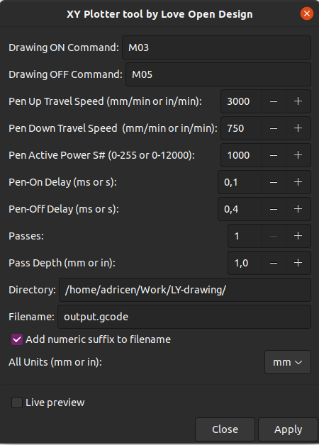

# LY Drawbot Tool by Love Open Design

This is the official repository for the XY Plotter Tool Inkscape extension.

You can find a french version of this document on our website : [love-open-design.com](https://love-open-design.com/laboratoire/xy-plotter-tool-par-love-open-design/)

## Purpose

This extension work for the [DIY XY Plotter High Precision Drawbot](https://www.aliexpress.com/item/32917861259.html?spm=a2g0s.9042311.0.0.3d9f6c37xpT5iS)

* This is made for Inkscape 1.0 and above.
* This machin is using GRBL Control with GRBL Arduino Shield

## Installation

Download the latest release [here](https://github.com/love-open-design/XY-Plotter-Tool-by-LOD/release). Make sure to select the release targeted towards the version of Inkscape you are using. You can find the version of Inkscape you're using under **Help** > **About**.

Unzip the files directly into the Inkscape user extensions folder. Inkscape lists the location of your extensions folder under **Edit** > **Preferences** > **System**.

Restart Inkscape and you're done.

## Gcode Panel

> Inside `Inkscape > Extension > Generate GCode for XY Plotter > XY Plotter tool from Love Open Design`

| Name | Definition | Default | Gcode Result |
|---|---| --- | --- |
| **Drawing On Command** | Gcode commande to lower down the Z-axis | `M3` | `M3 S1000` |
| **Drawing Off Command** | Gcode commande to upper the Z-axis | `M5` | `M5 S0` |
| **Pen Up Travel speed** | Travel speed with Pen Up | `3000` | `G1 F3000` |
| **Pen Down Travel speed** | Travel speed when drawing | `1500` | `G1 F1500` |
| **Pen Active Power** | command value to lower the pen | `1000` | `M3 S1000` |
| **Pen On Delay** | Delay after moving and before drawing | `0,1` | `G4 P0.1` |
| **Pen Off Delay** | Delay after drawing and before moving | `0,2` | `G4 P0.2` |
| **Passes** | Number of Passes | | |
| **Pass Depth** | *relative to cnc milling* | `1,0` | |
| **Directory** | path directory to save your file in absolute | | |
| **Filename + numeric value** | the numeric value increment your file with the same name | `output.gcode` | |
| **All Units** | **Important** Be sure to setting everything up to the same unit inside Inkscape - Document Units, Inkscape Units and  this output units otherwise it mae some stranges things | `mm` | |

### Custom G-code Header and Footer

Add "header" and "footer" text files without extensions in your destination directory to add custom commands. Don't forget to add a new line at the end of these two files.

If no files are detected the default values are :
- Header : G90 ; Absolute positioningon the
- Header : G0 Z0 ; Display path inside GRBL Control
- Footer : G1 X0 Y0 ; Move to X0 Y0

## For developers

Pull requests are welcome. Just make sure to test your code on both Python >=2.6 and >=3.5 for the main branch, and Python >= 3.6 for the development branch (In the next major release we'll drop support for older python versions in an effort to improve code readability).

## Credits

This inkscape extension is adapted from [J-Tech-Photonics-Laser-Tool](https://github.com/JTechPhotonics/J-Tech-Photonics-Laser-Tool) inkscape extension.

Thanks to [StuartB44](https://www.instructables.com/member/StuartB44/) for his work and infos on [Instructables](https://www.instructables.com/Fix-for-Image-Not-Showing-in-GRBLControl/) to display GCode inside GRBL Control
